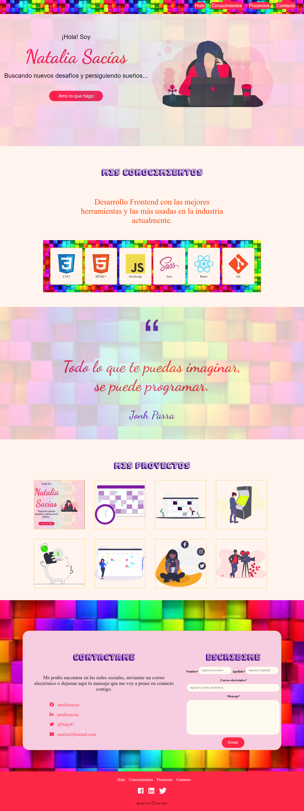

# Portafolio de Ada

### este ese el

 

***

### Si quiere vern como me quedo puedes darle click a este [enlace](https://github.com/Naty1401/00_proyecto) o puedes hacerlo desde este [otro]()

 

### Si quieres tener el codigo en tu compudadora deberas de seguir estos pasos:

- Ir al [repositorio](https://github.com/Naty1401/00_proyecto)

-Darle click al boton de forkear

-Darle click al boton de code

-Copiar la url

- Abrir tu termianl y poner el comando de **git clone <url>**

- Entrar a la carpeta del proyecto y abrirlo en tu IDE

### Este proyecto no neceista la instlacion de ninguna dependencia por ahora

 

***

### este deberia ser el resultado final

 

***

### este poyecto fue desarrollado para las chicas de  las cursada 6 de ada. Afrradezco a [Laydy]()

 
 

#### De Naty con 💖 para ustedes!

